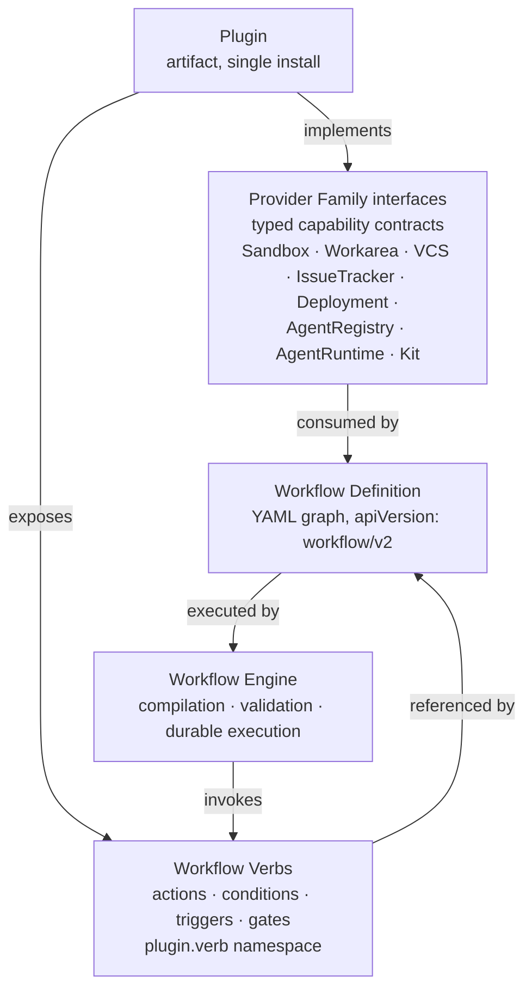
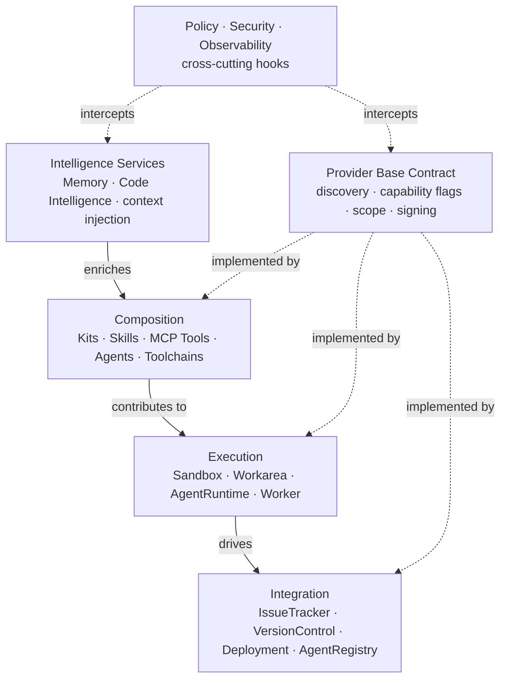

# 001 — Layered Execution Model

**Status:** Canonical (initial draft)
**Last updated:** 2026-04-27
**Boundary:** shared (OSS-canonical; platform extensions live at `rensei-architecture/001-layered-execution-model-platform-extensions.md`)

This is the canonical mental model for the AgentFactory OSS execution layer. Every other doc in this corpus elaborates one slice of what's described here. If a contributor reads only one doc, it should be this one.

## Goal of the platform

Donmai orchestrates fleets of coding agents — and increasingly, non-coding agents — to do real work against real customer codebases and content. The platform spans two products that share architecture but have different audiences:

- **The OSS execution layer** (`donmai`) — the open-source primitive set. One CLI, one bootstrap, you can work. Ships *one* batteries-included implementation per concept.
- **The SaaS / enterprise control plane** (`Donmai Platform`) — premium product. TUI install, signup, register workers, default workflow within minutes. Ships alternative implementations and the centralized control plane.

The single most important architectural commitment binding the two: **the OSS layer never ships an interface whose only working implementation lives downstream in the SaaS product.** Every contract in this corpus must have a usable OSS-shipped implementation.

The single most important *user* commitment: **using Donmai across LLM providers, sandbox providers, and issue trackers must produce a strictly better result than using any of those providers alone.** If we fail at that, we are an integration vendor, not a platform. The Intelligence Services layer (§4 below) is where this commitment is honored.

The single most important *quality* commitment: **project quality must compound, not decay.** Today's agent fleets show a Day-1-vs-Day-40 gap — sessions feel like magic on day one, like a slog on day forty. Conversational quality with the same models stays consistent. The architectural answer is in the Memory layer (`007`) — active context injection at session start, with this corpus and per-project CLAUDE.md as high-priority retrieval sources, plus session-end writes that compound knowledge across runs. If we don't close this gap, the platform fails its own scale story.

## Three orchestration principles

These resolve the sub-issue / coordination friction the legacy system has accumulated, and govern every workflow and template decision below.

### Principle 1 — Issues are human intent. Sessions are agent work. Sub-agents are intra-session optimization. Linear sub-issues are reserved for human use.

The system MUST NOT create Linear sub-issues for cost-efficiency decomposition. When a coordinator agent needs to use a cheaper model (sonnet/haiku) for sub-tasks, it spawns sub-agents *within its session* via the agent runtime's task primitive (Claude's Task tool; equivalents on other AgentRuntimeProviders). Linear sub-issues exist only when a human (or an agent at a human's explicit instruction during refinement) decides the work merits separate intent tracking.

### Principle 2 — Decomposition is a session-internal concern, not a workflow-level fork.

The legacy `-coordination` work types (`development-coordination`, `inflight-coordination`, `qa-coordination`, `acceptance-coordination`) are deprecated. Coordinators are agents using sub-agents heavily; they are not a different work type. Work types collapse from eight to five: `development`, `qa`, `acceptance`, `refinement`, `research`. Backlog-writer is elevated to a first-class agent (separate from work types) in `012`; it is the linchpin agent that determines downstream parallelism by writing issues with clear dependencies and haiku-executable scope.

The other side of this principle is that *control flow* across sessions — transitions between stages, success/failure routing, conditional dispatch — is a **workflow-canvas** concern, never platform-internal. The platform ships composable nodes (triggers, conditions, actions); the user wires them. Anything that hides chaining behavior behind auto-generated workflows, required schema fields, or closed runtime registries violates this. See `016-workflow-engine.md` § "Locus of definition — user-visible nodes only" for the binding rule, and `ADR-2026-05-03-locus-of-workflow-definition.md` for the decision record.

### Principle 3 — Quality must compound across sessions, projects, and tenants.

See the Day-1-vs-Day-40 commitment above. Architecturally enforced by: Memory writes that survive session end, retrieval that injects relevant prior context at session start, Kit-shippable intelligence extractors that enrich domain-specific knowledge, and the architecture corpus itself as a versioned canonical retrieval source.

## The distribution and runtime model

Above the typed capability layers below, three concepts govern what gets installed, what it exposes, and how it executes:



**Plugin** is the unit of distribution — one installable artifact, one OAuth grant, atomic lifecycle. A plugin declares zero, one, or many implementations of typed Provider Family interfaces, AND zero, one, or many named Workflow Verbs. Examples: a "Donmai Vercel Integration" plugin implements `DeploymentProvider` + `SandboxProvider` + `ObservabilityProvider`, and exposes verbs `vercel.deploy`, `vercel.list_deployments`, `vercel.get_logs`. Single OAuth flow grants the full scope set; multiple capabilities ride the same install.

**Provider Family** is the typed contract the platform reasons about. A scheduler picks providers by capability flags, not by plugin identity. Eight families today; see "The eight plugin families" below.

**Workflow Verb** is the operational vocabulary — named entry points the workflow engine can invoke. Namespacing is `<plugin>.<verb>` or `<plugin>.<resource>.<verb>`, enforced at registry validation to prevent collisions. Verbs declare typed input/output schemas so the engine validates wiring at compile time.

**Workflow Definition** is a graph of typed nodes (`trigger | condition | action | gate`) referencing verbs by id and major version (`vercel@1:vercel.deploy`). Versioned grammar (`apiVersion: workflow/v1`); details in `016`.

**Workflow Engine** is the runtime substrate. Compiles definitions, validates verb resolution, executes durably (signal events, gate timeouts), inherits from WEFT's typed-graph model. The orchestrator embeds the engine; it does not duplicate it.

The detail for these concepts lives in `015-plugin-spec.md` and `016-workflow-engine.md`.

## The layered model

Six layers, each with a clear purpose. Lower layers don't know about higher ones; higher layers compose lower ones.



### Layer 1 — Provider Base Contract

The ground floor. A unified `Provider` interface that all seven plugin families extend. It defines:

- **Discovery** — how a plugin advertises itself (npm package + manifest, or registry pull).
- **Capability declaration** — what this implementation actually supports, expressed as a typed capability struct. Schedulers and consumers reason about capability, not provider identity.
- **Scope resolution** — `project → org → tenant → global`, with explicit conflict semantics.
- **Signing and trust** — third-party plugins are signed; enterprise tenants may require sigstore-equivalent verification.
- **Lifecycle hooks** — pre/post/around extension points that the Policy layer attaches to.

Without this layer, the seven plugin families below would each invent their own discovery, their own capability vocabulary, and their own trust model. This layer exists to stop that drift.

Detail: **`002-provider-base-contract.md`**.

### Layer 2 — Integration

External-system adapters. Things that map external concepts (Linear issues, GitHub PRs, Vercel deployments) into the platform's internal model.

Four families today:

- **IssueTrackerProvider** — Linear (OSS default), Jira, Asana, Monday, sheets/Notion, "platform proxy mode."
- **VersionControlProvider** — git hosts (GitHub/GitLab/Bitbucket), Atomic, S3 with/without versioning, structured-content backends.
- **DeploymentProvider** — Vercel, Cloudflare Pages, custom CI hooks.
- **AgentRegistry** — local YAML, git-ref, langchain, openai-assistant, A2A remote agents.

These are the most "shaped" plugin families because external systems already have their own protocols; we adapt rather than invent. The base contract gives them shared vocabulary so a tenant can consistently say "use Jira for issues, Atomic for VCS, A2A for these agents" without each setting being a different config namespace.

Detail: **`008-version-control-providers.md`** for VCS specifically. IssueTracker, Deployment, and AgentRegistry are described inline in `002`.

### Layer 3 — Execution

Where work physically happens. Four sub-concepts that compose:

- **SandboxProvider** — *where* compute runs. Local Mac Studio fleet, Vercel Sandbox, E2B, Modal, Daytona, Docker, Kubernetes. Owns capacity, billing, network topology.
- **WorkareaProvider** — *what filesystem state* the worker sees. Acquire-deterministic-state / release-with-disposition lifecycle. Local impl uses a warm pool with scoped clean; snapshot-capable providers (E2B, Vercel) accelerate via filesystem or memory snapshots.
- **AgentRuntimeProvider** — *which model + agentic protocol* dispatches the LLM process. Claude (Anthropic), Codex (OpenAI), Amp, Spring AI, OpenCode, Ollama, Gemini, plus A2A as a transport flavor for federated work. Each declares capabilities like `supportsMessageInjection`, `supportsSessionResume`, `supportsToolPlugins`, `emitsSubagentEvents` (drives Topology view sub-agent visibility), `streamingTransport` (sse / ndjson / websocket / none), and `humanLabel` companions for capability flags so TUI surfaces don't re-encode semantics. Each also declares a **stability tier** (`stable | beta | unstable | registration-only`); the orchestrator (`013`) consults the tier when placing work, warning on `unstable` and refusing `registration-only` unless the session is explicitly a probe.
- **Worker** — the agent process itself. Registers with the orchestrator (dial-in or dial-out per `SandboxProvider.capabilities.transportModel`) and consumes work.

The split between SandboxProvider and WorkareaProvider is critical. They are not the same concern — even on a perfectly fresh K8s pod, if you reuse it for a second session without resetting filesystem state, you get the false-positive QA bug that motivated this entire architecture. SandboxProvider gives you *compute*; WorkareaProvider guarantees *filesystem determinism inside that compute*; AgentRuntimeProvider says *which LLM speaks the protocol the orchestrator expects*.

The codebase's existing `AgentProvider` (`packages/core/src/providers/types.ts`) is the OSS reference implementation of `AgentRuntimeProvider`. The renaming is corpus-only; the type stays the same.

Details:
- **`003-workarea-provider.md`** — Workarea contract and pool semantics.
- **`004-sandbox-capability-matrix.md`** — Sandbox capability flags and the cross-provider scheduler.
- **`013-orchestrator-and-governor.md`** — Worker, AgentRuntime, governor, dispatch loop.

### Layer 4 — Composition

What gets *into* a session. Buildpacks-shaped: third parties contribute language, framework, or domain support via a manifest with detect rules and contribution types.

A **Kit** declares:
- **Detect** — what makes this Kit applicable to a given workload (file presence, config patterns, repo metadata).
- **Provide** — contributions to the session: build/test/validate commands, prompt fragments, tool permissions, MCP servers, skills (SKILL.md), agent templates, A2A skill exports, *toolchain demands* (e.g., `java = "17"`).
- **Composition rules** — ordering, scope, conflict resolution when multiple Kits apply.

The killer architectural mechanic: **a Kit's toolchain demand is a signal to the SandboxProvider+WorkareaProvider scheduler.** Declaring `provide.toolchain = { java = "17" }` causes the scheduler to route to a warm pool member, image, or snapshot that satisfies the demand. Kits never know about sandbox providers; sandbox providers never know about Kits. The toolchain spec is the contract between them.

This layer is where the strategic timing call lives: the AI ecosystem is converging on a buildpacks-shaped pattern (MCP Registry, Anthropic Skills, AgentStack, nori-skillsets), but no system today bundles all four required dimensions (manifest + detect + registry + composition) with host-driven introspection. Landing this layer with a real spec is a chance to set the standard rather than adopt one.

Detail: **`005-kit-manifest-spec.md`**.

### Layer 5 — Intelligence Services

The differentiator. Memory and Code Intelligence accumulate value across sessions, providers, and tenants. They are not optional — every session reads from and writes to them, regardless of which sandbox hosted it or which Kit configured it.

- **Memory** — knowledge graph (Postgres + pgvector), in-session observation capture, AST-driven file-op extraction, cross-session injection, proactive context-aware suggestions.
- **Code Intelligence** — BM25 + vector hybrid search, repo map (PageRank), symbol search, dedup detection, cross-package dependency validation, type usage finding. The existing `@renseiai/agentfactory-code-intelligence` package is the OSS-shipped implementation.

These services are **provider-orthogonal**: an agent running on Vercel Sandbox with an E2B-paused workarea using a Spring Java Kit still benefits from the same memory graph and same code index. Routing across providers is what makes the platform composable; *enriching across providers* is what makes it differentiated.

Detail: **`007-intelligence-services.md`**.

### Layer 6 — Policy, Security, and Observability (cross-cutting)

Not a layer in the strict sense — a set of hooks that attach to the lifecycle events of every other layer. Pre/post/around for: provider acquire, session start, command exec, commit, push, merge, deploy, memory write, kit detect, prompt construction, model dispatch, etc.

This is where regulated-enterprise concerns live (banking, defense, healthcare). Three intertwined concerns share this layer because they all attach to the same hook surface, but they are distinct:

- **Policy** — *what is allowed*. Tenant-defined rules: which models can run on which data, which kits can deploy to which environments, which agents can write to which paths. Policy is **almost entirely a SaaS control-plane concern** — the OSS layer ships only the hook surface, not opinionated implementations.
- **Security** — *defense in depth across every layer*. Plugin signing and trust verification (Layer 1), tenant isolation and network policy (Layer 3), provenance and attestation (Layer 2 VCS), secret management (cross-cutting), prompt-injection and code-injection defense (Layer 4 Kit ingestion + Layer 5 memory writes), audit chains. Security is **shared between OSS and SaaS** — the OSS layer must ship secure defaults; the SaaS layer adds central administration and pluggable security providers (vulnerability scanners, code signers, identity providers, SIEM exporters).
- **Observability** — *what happened*. Structured event emission from every provider lifecycle hook. Workarea ID, session ID, model dispatch decisions, cost accumulation, tool calls, agent attribution. The basis for routing intelligence, agentic DORA metrics, cost-per-issue attribution, and post-hoc forensics.

Defense in depth is the architectural principle that makes this layer load-bearing for enterprise sales: **each lower layer enforces a security property locally, and the policy hooks compose them into tenant-defined enforcement chains.** A failure at any single layer is contained by the layers around it. See "Security as defense in depth" below for the per-layer responsibilities.

Detail: **`010-security-architecture.md`** (deferred — depends on every other contract being stable). The OSS execution layer needs to land first; security providers compose against stable interfaces, not moving targets.

## The eight plugin families

Bringing the layers together, here are the eight typed Provider Family contracts. Each is a typed interface; plugins implement zero, one, or many. The Provider base contract from Layer 1 is the common shape every family extends.

| Family | Layer | OSS-shipped impl | Platform-shipped alternates |
|---|---|---|---|
| **SandboxProvider** | Execution | Local (Mac Studio fleet) | Vercel Sandbox · E2B · Modal · Daytona · Docker · K8s |
| **WorkareaProvider** | Execution | Local-pool (scoped clean) | Snapshot-aware variants per sandbox |
| **AgentRuntimeProvider** | Execution | Claude (Anthropic) | Codex · Amp · Spring AI · OpenCode · Ollama · A2A |
| **VersionControlProvider** | Integration | Git (GitHub) | Atomic · S3 · structured-content backends |
| **IssueTrackerProvider** | Integration | Linear | Jira · Asana · Monday · Sheets/Notion · proxy mode |
| **DeploymentProvider** | Integration | (none — opt-in) | Vercel · Cloudflare · custom |
| **AgentRegistry** | Integration | Local YAML + git-ref | LangChain · OpenAI Assistant · A2A · third-party |
| **KitProvider** | Composition | TS/Next.js Kit (default codebase shape) | Rust · Go · Ruby · iOS · Spring Java · marketing/non-code |

The OSS layer ships a working implementation of every column-2 entry. The SaaS platform extends column 3. Tenants pick which providers they want; the orchestrator's scheduler reasons about capabilities, not provider identity.

The table above describes each family's **typed-internal contract surface** — the cross-provider plumbing the platform reasons about. The **user-visible surface** (workflow nodes, verbs, CLI subcommands, templates, UI palettes) stays *native-rich per provider* — the platform never collapses provider-specific affordances into a lowest-common-denominator shape. See `ADR-2026-05-10-native-rich-providers.md`.

A **Plugin** is an artifact that ships one or more rows above. The "Donmai Vercel Integration" plugin ships a `SandboxProvider` row (Vercel Sandbox), a `DeploymentProvider` row, an observability row, and a verb registry — one install, multiple family implementations.

## Security as defense in depth

Security is not a layer; it is a property each layer must contribute to. The architectural rule: **every layer enforces a security property locally, and the Layer 6 hooks compose them.** A breach or bypass at one layer is contained by the layers around it. The pluggable shape (a `SecurityProvider` plugin family is *not* added to the seven — security is a hook taxonomy, not a thing) means tenants can layer in scanners, signers, IDPs, and audit sinks without each subsystem reinventing them.

Per-layer responsibilities at a glance:

| Layer | Local security property |
|---|---|
| **Provider Base Contract** | Plugin signature verification, scope-resolution authority, capability declarations are tamper-evident. The base contract is what makes "this Kit was published by Spring Framework Org" provable. |
| **Integration** | VCS attestation (Atomic-style native, git-via-trailers), IssueTracker access tokens scoped to the minimum required, DeploymentProvider gate hooks (no deploy without policy approval). |
| **Execution** | Sandbox process isolation, network egress allowlists per session, secret injection at acquire time (not in code), worker dial-in/dial-out auth (one-time tokens, JWT rotation), workarea snapshot encryption at rest. |
| **Composition** | Kit signature verification before detect runs, untrusted-code execution policy (declarative kits run in-orchestrator, executable kits run in the workarea sandbox), MCP server permission scoping per kit, prompt-injection sanitization on ingested external content (kit docs, fetched URLs, memory queries). |
| **Intelligence Services** | Memory row-level security per tenant/project/scope (Cedar policies), code-index access controls, audit trail for every read/write, encryption of sensitive observations at rest. |
| **Policy/Security/Observability hooks** | Composable enforcement chains, audit log emission, breach detection, attestation aggregation (proving the full chain of custody for a change). |

Two non-obvious points worth flagging because they shape the design before doc 010 lands:

1. **Prompt-injection defense is a Layer 4 + Layer 5 concern, not a Layer 6 add-on.** When a Kit ingests external docs, when memory recalls past observations into a session prompt, when a research agent WebFetches a URL — those are all places where attacker-controlled content reaches the model. The ingestion path is where defense lives, not the policy hooks. Hooks observe; ingestion sanitizes.

2. **Provenance and audit are Layer 2 + Layer 6 cooperation.** Atomic VCS gives us native per-change attestation (Ed25519 + session metadata); git fakes it via commit trailers; the SaaS control plane aggregates both into a tenant-visible audit chain. The attestation primitive lives in VCS; the chain lives in observability. Don't put either in the wrong place.

Detail: **`010-security-architecture.md`** (deferred). The architecture above is intentionally schematic — concrete enforcement chains, threat model, and security-provider plugin shape land once the lower layers are stable.

## Capability flags as the abstraction technique

Throughout the corpus, you'll see one technique applied repeatedly: **expose capabilities as typed flags rather than encoding them in provider identity.** Example:

```ts
interface SandboxProviderCapabilities {
  transportModel: 'dial-in' | 'dial-out' | 'either'
  supportsFsSnapshot: boolean
  supportsPauseResume: boolean
  supportsCapacityQuery: boolean
  idleCostModel: 'zero' | 'storage-only' | 'metered'
  billingModel: 'wall-clock' | 'active-cpu' | 'invocation'
  regions: string[]
  maxConcurrent: number | null
  maxSessionDurationSeconds: number | null
}
```

This unlocks two things: (1) a scheduler that routes by capability (`acquire(spec)` picks the cheapest/fastest provider satisfying the demand), and (2) graceful introduction of new providers — adding `BlaxelSandbox` doesn't require teaching the scheduler about Blaxel; it just declares its capabilities. Every reference doc in this corpus follows the same pattern: the contract is a capability struct + a small set of lifecycle methods.

## The agentfactory ↔ Rensei Platform contract

<!-- BOUNDARY-SYNC-START: 001-agentfactory-rensei-platform-contract -->
<!-- This section is mirrored verbatim across
     agentfactory-architecture/001-layered-execution-model.md and
     rensei-architecture/001-layered-execution-model-platform-extensions.md.
     Any change MUST land simultaneously in both corpora via paired commits.
     See BOUNDARY.md § "Mechanism 3: synchronized verbatim mirror" and
     § "BOUNDARY-SYNC inline marker syntax". -->

The boundary stated as a discipline:

1. The OSS layer defines all interfaces in this corpus.
2. The OSS layer ships a working implementation of every interface — never *only* the type.
3. The SaaS control plane extends with alternate implementations and centralized administration (registries, signing, policy enforcement, multi-tenant management, the SaaS dashboard, the routing-intelligence panel).
4. The OSS layer never depends on the SaaS plane to function. Removing the platform leaves a usable single-machine product.
5. The boundary between them is a small set of pluggable function callbacks (`setAgentLauncher`-shaped), not subprocess or RPC. The platform composes the OSS layer as a library; both ship as one binary to end users.

<!-- BOUNDARY-SYNC-END: 001-agentfactory-rensei-platform-contract -->

**Canonical realization.** The cleanest demonstration of this discipline lives in the closed-source TUI consumer's main entry point, which calls `afcli.RegisterCommands(rootCmd, afcli.Config{...})` to import the OSS TUI's full command surface and extends with platform-specific commands on top. Public packages (`afclient`, `afcli`, `worker` in `agentfactory-tui`) carry the OSS interfaces; `internal/views` stays internal. The two-binary boundary works because the OSS layer never reaches up; the SaaS layer reaches down through public APIs only.

**Where this principle has tension: webhooks.** The OSS Linear integration today requires a public URL. Long-term answer: a localtunnel-style ephemeral URL spun up by the OSS CLI. Short-term: OSS users deploy a small webhook target on Railway or equivalent. SaaS users get the platform's webhook proxy (see platform extensions). Neither violates the principle — the OSS layer remains usable; webhooks are an integration concern, not a core dependency.

**See also:** the platform extensions to this contract — dual-surface discipline, the "premium = react-flow online + TUI parity" commitment, and the SaaS-side extensions to the contract — live at [`rensei-architecture/001-layered-execution-model-platform-extensions.md`](https://github.com/RenseiAI/rensei-architecture/blob/main/001-layered-execution-model-platform-extensions.md).

## What this corpus is not

- **Not implementation reference.** Concrete code lives in source repos (`agentfactory-tui`, future Kit repos). This corpus is *contracts*. Where this corpus and code diverge, the corpus is right and the code needs to align (or an ADR amends the corpus).
- **Not a roadmap.** Sequencing belongs in Linear; OSS readers can ignore Linear-realignment specifics — those live in `rensei-architecture/009-linear-realignment.md` and operate against the platform team's backlog.
- **Not the brand book.** Naming decisions (the `agentfactory` rename, the Kit-or-Ofuda question) are tracked separately and updated here only after the brand team confirms.

## Reading order for new contributors

Humans and fleet agents alike should consume in this order:

1. This doc (you're here).
2. **`002-provider-base-contract.md`** — without the base contract, the rest looks like a list of unrelated provider types.
3. **`015-plugin-spec.md`** — Plugin manifest, single-artifact distribution, atomic auth, verb registry. Read second; it formalizes how Provider Families and Workflow Verbs come together in one shippable artifact.
4. **`016-workflow-engine.md`** — Workflow grammar, node taxonomy, durable execution, versioning. Read third; it's the runtime substrate that consumes everything below.
5. The reference doc for whichever layer you are working on: `003` (workarea), `004` (sandbox), `005` (kit), `007` (intelligence + context injection), `008` (VCS).
6. **`013-orchestrator-and-governor.md`** — orchestrator, governor, worker, AgentRuntime dispatch. The runtime that embeds the workflow engine. (Topology view + agentfactory merge-queue specifics live in `rensei-architecture`.)
7. **`014-tui-operator-surfaces.md`** — TUI display primitives + capability-chip pattern; read if you're building TUI features. (Live capacity contract + dual-surface discipline live in `rensei-architecture`.)
8. **`006-cross-provider-interactions.md`** — the seams. Read once you understand the individual layers; this is where most subtle bugs live. (Seam 4 platform implementation block + Seam 6 audit-chain extension live in `rensei-architecture`.)
9. **`010-security-architecture.md`** — once landed. Until then, the "Security as defense in depth" section above is the source of truth.

## How to disagree with this doc

This doc is the canonical synthesis of an architectural conversation, not a final answer. To disagree:

1. Open an ADR proposing the change (copy `ADR-template.md`).
2. State the affected sections of this doc and the reference docs.
3. Declare the ADR's `boundary:` field in frontmatter — `OSS-only`, `platform-only`, or `shared`. See `BOUNDARY.md` for the verdict definitions.
4. Commit the ADR; if the discussion converges, update this doc and the affected references in the same commit that flips the ADR to `Accepted`.

Direct edits without an ADR are fine for clarifications, examples, and typo fixes. Anything that changes a contract, a layer's responsibility, or a discipline statement requires an ADR.

**Edits to the BOUNDARY-SYNC section** ("The agentfactory ↔ Rensei Platform contract" five-point discipline above) require paired commits to both `agentfactory-architecture/001-layered-execution-model.md` and `rensei-architecture/001-layered-execution-model-platform-extensions.md`. See `BOUNDARY.md` § "Mechanism 3: synchronized verbatim mirror".
