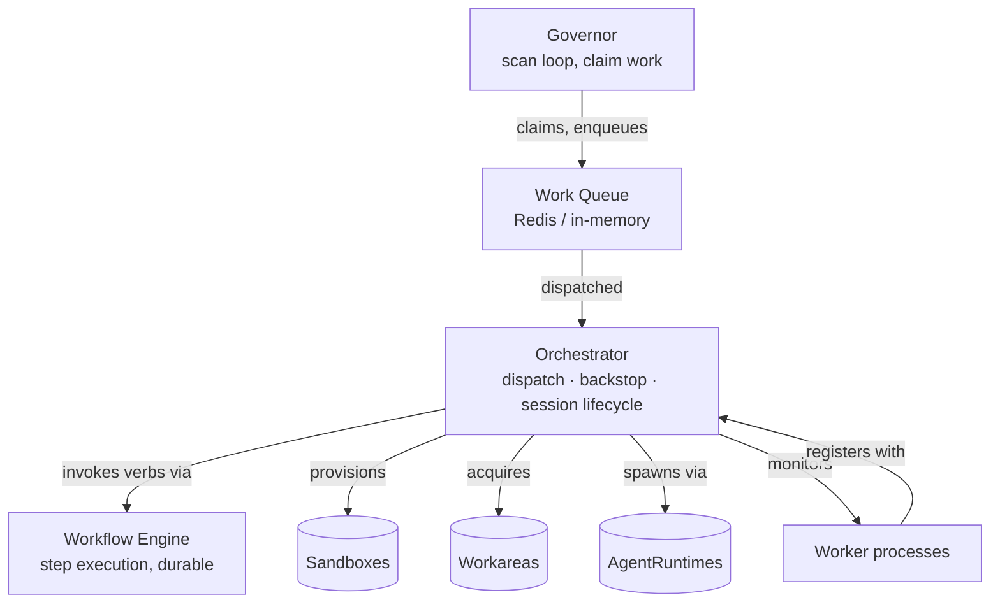

# 013 — Orchestrator, Governor, Worker, AgentRuntime

**Status:** Reference (initial draft)
**Last updated:** 2026-04-27
**Boundary:** shared (OSS-canonical; platform extensions live at `rensei-architecture/013-orchestrator-and-governor-platform-extensions.md`)
**Related:** `001-layered-execution-model.md`, `004-sandbox-capability-matrix.md`, `015-plugin-spec.md`, `016-workflow-engine.md`, `011-local-daemon-fleet.md`.

## Why this exists

The Layer 3 (Execution) abstractions in `001` are typed contracts — Sandbox, Workarea, AgentRuntime, Worker. This doc covers the **runtime that orchestrates them**: the orchestrator service that dispatches sessions, the governor scan loop that watches for work, the worker process model, and the AgentRuntime dispatch surface. The Topology view (React Flow operator dashboard) and the Donmai merge-queue specifics live on the platform side; see the platform-extensions doc.

## The orchestrator

The orchestrator is the runtime that **embeds the workflow engine** (`016`) and dispatches its actions to **workers** running in **sandboxes** with **workareas**, using a chosen **AgentRuntime** to drive the LLM process. It does not duplicate the workflow engine; it composes it.



**What lives in the orchestrator (vs in plugins or workflow engine):**

- Session lifecycle: spawn, monitor, terminate, retry, backstop
- Work queue management (claim, dispatch, dedupe, idempotency)
- Cross-provider scheduling (per `004` capability flag matching)
- Worker process supervision (heartbeat, drain, reap)
- Provider capability discovery and resolver registration
- **Stability-tier-aware placement** — consults each provider's declared stability tier (`stable | beta | unstable | registration-only`, per `002`) when placing work; warns on `unstable` selection for production sessions and refuses to dispatch to `registration-only` providers unless the session is explicitly a probe / dry-run.
- Completion contract validation (per work type)
- Session-end backstop (push branches, create PRs, post results)

**What does NOT live in the orchestrator:**

- Workflow grammar / compilation / step memoization → `016` workflow engine
- Plugin manifest discovery / verb resolution / signature verification → `015` plugin spec
- Filesystem state for the worker → `003` workarea provider
- Compute provisioning → `004` sandbox provider

## The governor

The governor is the **scan-and-dispatch loop** that watches external systems for new work. In the legacy donmai-libraries codebase, this is `packages/cli/src/orchestrator.ts`'s scan loop and `packages/server/src/governor*` files. It is being ported to Go in `donmai`.

```
┌──────────────────────────────────────────────────────────┐
│  Governor cycle (every N seconds, default 30)            │
├──────────────────────────────────────────────────────────┤
│  1. List issues from configured IssueTrackerProviders    │
│     in scope (project allowlist, monorepo paths)         │
│  2. Filter by status (Backlog → development trigger,     │
│     Started → inflight, Finished → qa, etc.)             │
│  3. Filter against active fleet quota                    │
│  4. Apply failure-backoff and dispatch-cap gates         │
│  5. For each eligible issue, build a SessionSpec         │
│  6. Enqueue to the work queue                            │
└──────────────────────────────────────────────────────────┘
```

Governor cycle is **scope-bounded** — `.rensei/config.yaml` (or platform config in SaaS) declares which projects this governor handles. Multiple governors can run in parallel against different scopes; they don't fight for work because the queue claim is atomic.

Governor is **stateless across cycles** — all state lives in the work queue, the IssueTrackerProvider, and the orchestrator's session table. Restarting a governor doesn't lose work in flight; it just re-scans on the next cycle.

### Two governor loops: issue-driven and time-driven

The scan-and-dispatch loop above is the **issue-driven loop** — it watches trackers and builds `SessionSpec`s. A parallel **time-driven loop** selects due **batch** rows on a schedule and builds `BatchJobSpec`s (discriminated by `workType`), enqueuing to the **same** work queue. Both loops are scope-bounded, stateless across cycles, and rely on the same atomic queue claim. Batch work-types (code-survival scans, KG extraction — see `ADR-2026-06-03-batch-work-type-category.md`) ride the time-driven loop and are executed by registered batch handlers that do not drive an `AgentRuntimeProvider`.

## The worker

A **worker** is the OS process that runs an agent session. It registers with the orchestrator at start, claims work from the queue, executes the session (driving the AgentRuntime), and reports results. The reference implementation lives in `donmai/worker/` (Go). A worker also claims **batch work** from the same poll loop — `workType`-discriminated `BatchJobSpec`s routed to a batch handler (e.g. `donmai/codesurvival/`, `donmai/kgextract/`) instead of the AgentRuntime; unknown `workType`s are logged and skipped so stale workers degrade gracefully.

### Worker registration (the dial-out flow)

The codebase ships a working dial-out registration model. From `donmai/worker/types.go`:

```go
type RegisterRequest struct {
    Hostname         string   // identifies the machine
    Version          string   // worker binary version
    MaxAgents        int      // concurrent session capacity
    Capabilities     []string // tags: "claude", "codex", ...
    ActiveAgentCount int      // current load
    Status           string   // "idle" | "busy" | "draining"
}

type RegisterResponse struct {
    WorkerID                    string  // assigned by orchestrator
    RuntimeJWT                  string  // scoped to this worker's lifetime
    HeartbeatIntervalSeconds    int
    PollIntervalSeconds         int
}
```

The flow:

1. Worker process starts. Reads a one-time registration token from env (`rsp_live_…`-style).
2. POSTs `RegisterRequest` to the orchestrator's registration endpoint.
3. Orchestrator validates the token (SHA-256 hashed in DB, short TTL), assigns a `WorkerID`, mints a `RuntimeJWT` scoped to that worker.
4. Worker discards the registration token and uses the JWT for subsequent calls.
5. Worker polls (`PollIntervalSeconds`) for available work claims and heartbeats (`HeartbeatIntervalSeconds`) to indicate liveness.

This is the **dial-out** transport flavor (per `004`). The orchestrator does not initiate connections to workers; workers come to it. This is the right model for K8s pods, Docker containers, and the user's local Mac Studio fleet (over LAN, loopback, or VPN).

### `Capabilities []string` — precedent for typed capability struct

The current worker capability tags (`["claude", "codex", "amp"]`) are a **lightweight precedent** for what `004` formalizes as a typed `SandboxProviderCapabilities` struct. The migration path:

1. **Today:** workers declare untyped tag list. Orchestrator matches by string membership.
2. **Migration:** workers declare both — `Capabilities []string` (legacy) and `CapabilitiesTyped SandboxCapabilitiesV1` (typed). Orchestrator prefers typed when present.
3. **Eventual:** workers declare typed-only. Tag list deprecated.

This is the same migration pattern any plugin's verb registry uses (`015`) — keep the existing field as fallback, add the typed one, eventually deprecate.

### Capability tag in the AgentRuntime sense

The current `Capabilities` tags conflate two things:
- **AgentRuntime** support (claude, codex, amp) — *which LLM dispatch protocol the worker can run*.
- **Resource** capacity (`MaxAgents`) — *how much concurrent session work the worker can handle*.

The architecture splits these. AgentRuntime support belongs on `AgentRuntimeProvider.capabilities.kind`; resource capacity belongs on the worker's declared `SandboxProviderCapabilities.maxConcurrent`. The legacy tag list maps onto AgentRuntime kinds for now.

### Foreground vs daemon mode

Two modes per `004` and `011`:

- **Foreground mode** (legacy): worker spawned per VSCode session, lifetime tied to that editor. Anti-pattern at fleet scale; deprecated as default.
- **Daemon mode** (recommended): one long-running daemon per machine, registers as a worker pool, multi-project allowlist, auto-update. Detail in `011`.

The daemon and the worker are not the same process. The daemon is a long-running supervisor that:
- Registers the *machine's* capacity once at boot
- Spawns child worker processes per session on demand
- Forwards work claims to children
- Heartbeats on behalf of children

A child worker is a short-lived process that runs one session. When the session ends, the child exits; the daemon reaps and reports completion.

## AgentRuntime dispatch

The orchestrator selects an `AgentRuntimeProvider` per session based on:

1. **Tenant config** — preferred runtime for this project (claude, codex, etc.).
2. **Capability match** — workflow may declare `requires.capabilities: ['agent.supportsToolPlugins']`; runtime must satisfy.
3. **Cost / latency hints** — Routing Intelligence (two-dimensional per `004`) picks based on historical performance.
4. **Model selection** — within an AgentRuntime, the dispatch model (Opus/Sonnet/Haiku for Claude; equivalent tiers elsewhere) is set per workflow step or session profile.

The orchestrator does **not** pick models per-step within an agent's session — that's the agent's own decision (and the topic of Principle 1 in `001`: sub-agents within sessions, not sub-issues). The orchestrator picks the *runtime* and the *initial model* for the session; the agent can spawn cheaper sub-agents internally.

### Sub-agent dispatch (intra-session)

Per `001` Principle 2, decomposition is session-internal. When a coordinator agent uses sub-agents:

- **Claude provider:** Uses the Task tool. Sub-agent events emit through the session's event stream (`emitsSubagentEvents: true` capability). Operator-surface views render them as nested nodes when the runtime supports it.
- **Codex / Spring AI / others:** Per-provider behavior varies. If the runtime doesn't expose a Task-equivalent or doesn't emit events for it, sub-agents are invisible to operator-surface views (`emitsSubagentEvents: false`). The architecture admits this; the operator-surface (`014`) shows a "sub-agent visibility limited" indicator for runs on those providers.

Sub-agents share the parent's workarea by default (per `003` `mode: 'shared'`). Cross-machine fan-out is possible but rare — for very large work, a coordinator may dispatch parallel sub-sessions to the orchestrator (which appear as separate sessions in operator-surface views, parented to the coordinator).

### The Linear sub-issue anti-pattern

Per `001` Principle 1, the system **must not create Linear sub-issues for cost-efficiency decomposition**. Linear sub-issues are reserved for human intent. Today's `backlog-writer` agent's "1-point gets 3 sub-issues" pattern is deprecated. The orchestrator surfaces this rule as a refusal: any agent attempting to create Linear sub-issues during a non-refinement session gets a hard error from the IssueTrackerProvider.

### Sibling context repos (ADR-2026-07-07)

When a work item's `env` carries `DONMAI_SIBLING_REPOS` (comma-separated `<git-url>[#ref]` entries), the runner shallow-clones each entry as a **read-only sibling of the session worktree** after workspace provisioning — so agents find their governing architecture corpus at `../<name>` exactly as repo `AGENTS.md` contracts promise. Existing siblings are freshened best-effort (`pull --ff-only`); failures are logged and never fatal to the session; agents without a pre-cloned sibling fall back to cloning it themselves. Full contract: `ADR-2026-07-07-sibling-context-repos.md`.

## Completion contracts and backstop

Per the existing `packages/core/src/orchestrator/completion-contracts.ts`, each work type has required outputs:

| Work Type | Required Outputs |
|---|---|
| `development` / `inflight` | Commits on branch, branch pushed, PR created |
| `qa` | Work result (passed/failed), comment posted |
| `acceptance` | Work result (passed/failed) |
| `refinement` | Comment posted |
| `research` | Issue description updated |
| `merge` | PR merged |

(With `-coordination` work types deprecated per `001` Principle 2, the table collapses to development/qa/acceptance/refinement/research/merge.)

The orchestrator's session-end backstop (`packages/core/src/orchestrator/session-backstop.ts`) auto-recovers missing outputs:

- Pushes unpushed branches
- Creates PRs from pushed branches that lack one
- Detects existing PRs not captured in agent output

Fields requiring agent judgment (`work_result`, `comment_posted`) cannot be backstopped — the orchestrator posts a diagnostic comment and blocks status promotion. This contract survives the architecture reframe; it's already provider-agnostic.

### The turn-result manifest is the agent-owned half of the contract (ADR-2026-06-15)

The judgment fields above (`work_result` and the summary) are **agent-owned** —
the backstop cannot synthesise them. They reach the orchestration not by
scraping a `WORK_RESULT:<verdict>` marker out of the agent's free-form final
message, but by a structured file the agent writes:
**`.agent/turn-result.json`** (the turn-result manifest). The runner reads +
schema-validates it FIRST in the verdict resolution order
(manifest → `WORK_RESULT` marker scrape → deterministic backstop); the manifest
wins when present, and the marker is retained as the back-compat fallback.

The manifest is minimal + versioned, carrying only the agent-owned half of the
completion contract:

```json
{ "schemaVersion": 1, "verdict": "passed|failed|blocked",
  "summary": "...", "blockedReason": "...",
  "pullRequestUrl": "...", "commitSha": "..." }
```

Runner-owned signals (cost, provider session id, the failure-mode
classification, the authoritative post-backstop head SHA) stay on the terminal
result envelope, never in the manifest. The runner posts the validated manifest
verbatim on the terminal status wire (additively — an old peer omits it and the
consumer falls back to the marker scan). A `blocked` verdict is the structured
form of the deliberate-decline signal and routes to needs-clarification, not a
generic failure. See `ADR-2026-06-15-turn-result-manifest.md`.

### CI verification is orchestration-owned and durable (ADR-2026-06-10)

The `development` row above ends at "PR created" **deliberately** — remote-CI
verification is not part of the agent session's completion contract:

- The agent emits its durable `WORK_RESULT` marker as soon as the
  implementation is complete, **local** verification (tests / typecheck /
  lint) is green, and the branch is pushed (+ PR opened where the agent owns
  PR-open). It MUST NOT wait for remote CI inside the session — and more
  generally MUST NOT park on in-process harness timers (schedule-wakeup
  tools, background polls) expecting to be woken after its final message.
  The runner treats the terminal event as end-of-session and tears the
  provider down; in-process wake-up state dies with it.
- The CI wait happens at the orchestration layer as a **durable
  suspend/resume gate** correlated on the session's head commit SHA. The
  runner captures the SHA at envelope-build time (after the backstop, which
  may add commits) into `Result.CommitSHA` and carries it on the terminal
  status post; the develop→verify hop suspends on a `workflow_run.completed`
  signal gate and resumes by webhook (pass/fail) or timer (timeout →
  reconciliation). See `ADR-2026-06-10-durable-ci-wait.md` and
  `016-workflow-engine.md` § `gate`.
- Consequence for the backstop: `work_result` remains non-backstoppable
  agent judgment, but CI outcome is **never** agent judgment — it is
  reconciled by the orchestration layer from the CI provider's events.

## macOS binary distribution — signing + notarization required

**Rule (the OSS architectural commitment):** every macOS binary published from this corpus's reference implementations MUST be Developer-ID-signed with hardened runtime enabled, notarized via Apple's `notarytool`, and have its notarization ticket stapled to the archive.

This is a reproducible-anywhere knowledge: any forked OSS deployment of `donmai` that publishes macOS binaries must follow this same signing model with its own Developer ID. The platform-side operational state (which Apple Team ID, which secret store, which cask repo) lives in the platform extensions doc.

### Why this matters

Unsigned macOS binaries trigger Gatekeeper popups in System Settings → Privacy & Security on first launch, requiring user-level approval. Worse, when an unsigned binary is registered as a launchd user-level service (e.g., via `donmai host install`), launchd may **silently** fail to spawn it — there's no popup, the daemon just never comes up. Both cases violate the binary distribution acceptance gate: a release whose install path requires user-clickthrough is not "clean" by any product standard.

CI-green is necessary but not sufficient: GitHub-Actions Linux runners don't exercise Gatekeeper, so unsigned macOS releases pass CI while breaking real users on every install.

### What the OSS commitment requires

For any forked OSS deployment shipping macOS binaries:

- The release pipeline MUST run `goreleaser` with a `notarize.macos` block (or equivalent) that signs and notarizes the binary.
- The signing identity MUST be a Developer ID Application certificate (Apple's "Developer ID Application" issuer), not an in-house cert.
- Hardened runtime MUST be enabled.
- Notarization MUST succeed and the ticket MUST be stapled to the archive.

The reference implementation in `donmai/.goreleaser.yaml` ships a working `notarize.macos` block that any fork can copy.

### Verification gate

A `spctl --assess --verbose <binary>` step in any smoke harness asserts the output contains `accepted` + `source=Notarized Developer ID`. Any release that ships unsigned or improperly-notarized binaries fails the smoke immediately. The check is a no-op on Linux.

### Future binaries

Any future binary added to the OSS distribution channel inherits this rule. Its release configuration MUST have a `notarize.macos` block; its release workflow MUST run on `macos-latest`. The smoke harness adds a corresponding `spctl --assess` step.

## OSS vs SaaS responsibilities

| Concern | OSS | SaaS |
|---|---|---|
| Orchestrator (single-tenant) | ✅ ships | inherits |
| Governor scan loop | ✅ ships | inherits |
| Worker registration + dial-out | ✅ ships | inherits |
| Work queue (Redis or in-memory) | ✅ ships | ✅ Redis |
| Completion contract + backstop | ✅ ships | inherits |
| Topology view (React Flow) | ❌ TUI equivalent | ✅ ships |
| TUI fleet view | ✅ ships | extended |
| Multi-tenant orchestrator | ❌ | ✅ owns |
| Routing Intelligence panel | ❌ | ✅ owns |
| Cross-machine fleet aggregation | partial (LAN) | ✅ owns (cloud-burst) |
| macOS signing rule | ✅ ships (architectural commitment) | extends with operational state |

OSS users get a fully working orchestrator + governor + worker fleet on their Mac Studio. The SaaS extensions (Topology view, Routing Intelligence panel, multi-tenant orchestration, cloud-burst aggregation, the platform-merge-queue specifics) live in the platform-extensions doc.

## Open questions

1. **Worker draining when daemon updates.** Per `011`, the daemon drains in-flight work before self-update. Sub-agents in a Claude session count as in-flight; do we wait for them too? Default: yes — sub-agent completion rolls up to parent session completion.
2. **Cross-machine sub-agent fan-out.** Today's session-tree model handles parent-child relationships within one daemon. If a coordinator wants to dispatch parallel sub-sessions across machines, those become *separate* sessions in the orchestrator (parented via metadata). Operator-surface views render them as siblings of the coordinator with edges. Worth surfacing in the workflow engine as a verb (`donmai.spawn_parallel_subsession`)?
3. **Workflow-engine vs orchestrator-vs-governor boundary clarity.** Three things are involved in turning a Linear issue into a session: workflow trigger fires, governor (or workflow engine?) creates a SessionSpec, orchestrator dispatches. Today the boundary is fuzzy — the legacy SDLC YAML implements logic that arguably belongs in the governor. As workflows mature, more logic migrates from governor to workflow definition, and the governor shrinks toward "fire workflow on trigger event." Worth tracking; not blocking.

These are intentional gaps for ADRs as we get implementation experience.
