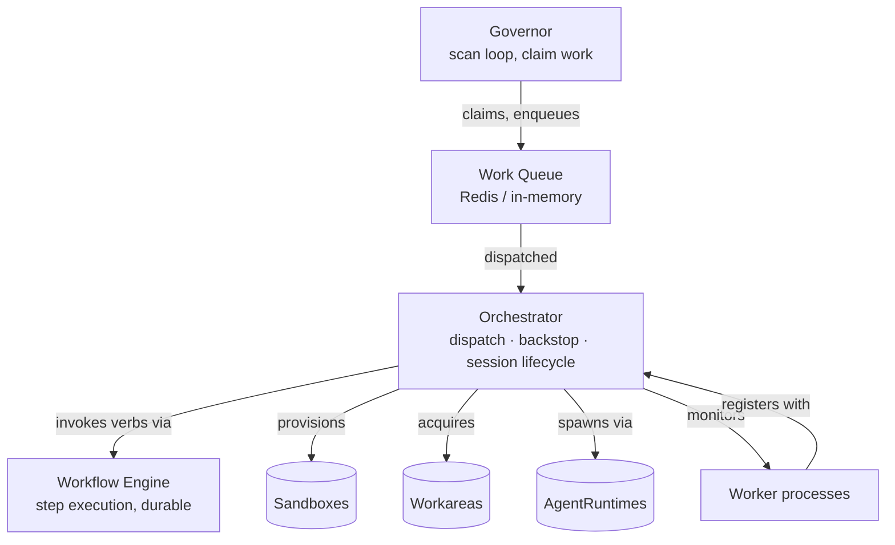

# 013 — Orchestrator, Governor, Worker, AgentRuntime

**Status:** Reference (initial draft)
**Last updated:** 2026-07-22
**Boundary:** shared (OSS-canonical; platform extensions live at `rensei-architecture/013-orchestrator-and-governor-platform-extensions.md`)
**Related:** `001-layered-execution-model.md`, `004-sandbox-capability-matrix.md`, `015-plugin-spec.md`, `016-workflow-engine.md`, `011-local-daemon-fleet.md`, `ADR-2026-07-18-bounded-terminal-workarea-leases.md`.

## Why this exists

The Layer 3 (Execution) abstractions in `001` are typed contracts — Sandbox, Workarea, AgentRuntime, Worker. This doc covers the **runtime that orchestrates them**: the orchestrator service that dispatches sessions, the governor scan loop that watches for work, the worker process model, and the AgentRuntime dispatch surface. The Topology view (React Flow operator dashboard) and the Donmai merge-queue specifics live on the platform side; see the platform-extensions doc.

## The orchestrator

The orchestrator is the runtime that **embeds the workflow engine** (`016`) and dispatches its actions to **workers** running in **sandboxes** with **workareas**, using a chosen **AgentRuntime** to drive the LLM process. It does not duplicate the workflow engine; it composes it.


```mermaid
graph TB
    G[Governor<br/>scan loop, claim work]
    O[Orchestrator<br/>dispatch · backstop · session lifecycle]
    W[Workflow Engine<br/>step execution, durable]
    Q[Work Queue<br/>Redis / in-memory]

    R[(Workareas)]
    S[(Sandboxes)]
    A[(AgentRuntimes)]
    Wk[Worker processes]

    G -->|claims, enqueues| Q
    Q -->|dispatched| O
    O -->|invokes verbs via| W
    O -->|provisions| S
    O -->|acquires| R
    O -->|spawns via| A
    O -->|monitors| Wk
    Wk -->|registers with| O
```

**What lives in the orchestrator (vs in plugins or workflow engine):**

- Session lifecycle: spawn, monitor, terminate, retry, backstop
- Work queue management (claim, dispatch, dedupe, idempotency)
- Cross-provider scheduling (per `004` capability flag matching)
- Worker process supervision (heartbeat, drain, reap)
- Provider capability discovery and resolver registration
- **Stability-tier-aware placement** — consults each provider's declared stability tier (`stable | beta | unstable | registration-only`, per `002`) when placing work; warns on `unstable` selection for production sessions and refuses to dispatch to `registration-only` providers unless the session is explicitly a probe / dry-run.
- Completion contract validation (per work type)
- Session-end backstop (push branches, create PRs, post results)

**What does NOT live in the orchestrator:**

- Workflow grammar / compilation / step memoization → `016` workflow engine
- Plugin manifest discovery / verb resolution / signature verification → `015` plugin spec
- Filesystem state for the worker → `003` workarea provider
- Compute provisioning → `004` sandbox provider

## The governor

The governor is the **scan-and-dispatch loop** that watches external systems for new work. In the legacy donmai-libraries codebase, this is `packages/cli/src/orchestrator.ts`'s scan loop and `packages/server/src/governor*` files. It is being ported to Go in `donmai`.

```
┌──────────────────────────────────────────────────────────┐
│  Governor cycle (every N seconds, default 30)            │
├──────────────────────────────────────────────────────────┤
│  1. List issues from configured IssueTrackerProviders    │
│     in scope (project allowlist, monorepo paths)         │
│  2. Filter by status (Backlog → development trigger,     │
│     Started → inflight, Finished → qa, etc.)             │
│  3. Filter against active fleet quota                    │
│  4. Apply failure-backoff and dispatch-cap gates         │
│  5. For each eligible issue, build a SessionSpec         │
│  6. Enqueue to the work queue                            │
└──────────────────────────────────────────────────────────┘
```

Governor cycle is **scope-bounded** — `.rensei/config.yaml` (or platform config in SaaS) declares which projects this governor handles. Multiple governors can run in parallel against different scopes; they don't fight for work because the queue claim is atomic.

Governor is **stateless across cycles** — all state lives in the work queue, the IssueTrackerProvider, and the orchestrator's session table. Restarting a governor doesn't lose work in flight; it just re-scans on the next cycle.

### Two governor loops: issue-driven and time-driven

The scan-and-dispatch loop above is the **issue-driven loop** — it watches trackers and builds `SessionSpec`s. A parallel **time-driven loop** selects due **batch** rows on a schedule and builds `BatchJobSpec`s (discriminated by `workType`), enqueuing to the **same** work queue. Both loops are scope-bounded, stateless across cycles, and rely on the same atomic queue claim. Batch work-types (code-survival scans, KG extraction — see `ADR-2026-06-03-batch-work-type-category.md`) ride the time-driven loop and are executed by registered batch handlers that do not drive an `AgentRuntimeProvider`.

## The worker

A **worker** is the OS process that runs an agent session. It registers with the orchestrator at start, claims work from the queue, executes the session (driving the AgentRuntime), and reports results. The reference implementation lives in `donmai/worker/` (Go). A worker also claims **batch work** from the same poll loop — `workType`-discriminated `BatchJobSpec`s routed to a batch handler (e.g. `donmai/codesurvival/`, `donmai/kgextract/`) instead of the AgentRuntime; unknown `workType`s are logged and skipped so stale workers degrade gracefully.

### Worker registration (the dial-out flow)

The codebase ships a working dial-out registration model. From `donmai/worker/types.go`:

```go
type RegisterRequest struct {
    Hostname         string   // identifies the machine
    Version          string   // worker binary version
    MaxAgents        int      // concurrent session capacity
    Capabilities     []string // tags: "claude", "codex", ...
    ActiveAgentCount int      // current load
    Status           string   // "idle" | "busy" | "draining"
}

type RegisterResponse struct {
    WorkerID                    string  // assigned by orchestrator
    RuntimeJWT                  string  // scoped to this worker's lifetime
    HeartbeatIntervalSeconds    int
    PollIntervalSeconds         int
}
```

> **Two heartbeat implementations, not one.** `donmai` ships two separate
> worker/heartbeat implementations: the generic `worker/` package's
> `RegisterRequest.Status` above, and the `daemon/` package's
> `HeartbeatPayload.Status` (`daemon/types.go`) used by the local-daemon fleet
> (`011-local-daemon-fleet.md`). They are unrelated structs on unrelated wire
> paths. Conflating them previously masked a real bug: the `daemon/` package
> computed its status every beat but never serialized it onto the wire — see
> `ADR-2026-08-03-daemon-host-status-signal-completion.md`. When citing "the
> worker sends its status," always name which package you mean.

The flow:

1. Worker process starts. Reads a one-time registration token from env (`rsp_live_…`-style).
2. POSTs `RegisterRequest` to the orchestrator's registration endpoint.
3. Orchestrator validates the token (SHA-256 hashed in DB, short TTL), assigns a `WorkerID`, mints a `RuntimeJWT` scoped to that worker.
4. Worker discards the registration token and uses the JWT for subsequent calls.
5. Worker polls (`PollIntervalSeconds`) for available work claims and heartbeats (`HeartbeatIntervalSeconds`) to indicate liveness.

This is the **dial-out** transport flavor (per `004`). The orchestrator does not initiate connections to workers; workers come to it. This is the right model for K8s pods, Docker containers, and the user's local Mac Studio fleet (over LAN, loopback, or VPN).

### `Capabilities []string` — precedent for typed capability struct

The current worker capability tags (`["claude", "codex", "amp"]`) are a **lightweight precedent** for what `004` formalizes as a typed `SandboxProviderCapabilities` struct. The migration path:

1. **Today:** workers declare untyped tag list. Orchestrator matches by string membership.
2. **Migration:** workers declare both — `Capabilities []string` (legacy) and `CapabilitiesTyped SandboxCapabilitiesV1` (typed). Orchestrator prefers typed when present.
3. **Eventual:** workers declare typed-only. Tag list deprecated.

This is the same migration pattern any plugin's verb registry uses (`015`) — keep the existing field as fallback, add the typed one, eventually deprecate.

### Capability tag in the AgentRuntime sense

The current `Capabilities` tags conflate two things:
- **AgentRuntime** support (claude, codex, amp) — *which LLM dispatch protocol the worker can run*.
- **Resource** capacity (`MaxAgents`) — *how much concurrent session work the worker can handle*.

The architecture splits these. AgentRuntime support belongs on `AgentRuntimeProvider.capabilities.kind`; resource capacity belongs on the worker's declared `SandboxProviderCapabilities.maxConcurrent`. The legacy tag list maps onto AgentRuntime kinds for now.

### Foreground vs daemon mode

Two modes per `004` and `011`:

- **Foreground mode** (legacy): worker spawned per VSCode session, lifetime tied to that editor. Anti-pattern at fleet scale; deprecated as default.
- **Daemon mode** (recommended): one long-running daemon per machine, registers as a worker pool, multi-project allowlist, auto-update. Detail in `011`.

The daemon and the worker are not the same process. The daemon is a long-running supervisor that:
- Registers the *machine's* capacity once at boot
- Spawns child worker processes per session on demand
- Forwards work claims to children
- Heartbeats on behalf of children

A child worker is a short-lived process that runs one session. When the session ends, the child exits; the daemon reaps and reports completion.

## AgentRuntime dispatch

The orchestrator admits a versioned `DispatchIntent` and selects one
`ResolvedExecutionCell` per session based on:

1. **Explicit intent and config** — requested harness/model/endpoint/auth/
   placement, or documented defaults whose provenance is recorded.
2. **Declared compatibility** — the harness/endpoint matrix is the ceiling.
3. **Live proof** — runtime inventory, auth binding, placement reachability,
   requested mode/capabilities, and evidence tier all satisfy the intent.
4. **Cost / latency hints** — routing may rank already-valid candidates but
   cannot invent an undeclared fallback.

Before enqueue, the orchestrator persists an immutable `AdmissionReceipt` and
returns a `SessionRef`. A claim-bound pool writes a separate `ClaimReceipt`
after host selection and the narrow-only gate; neither claim nor spawn mutates
the first receipt. Secret delivery remains after admission/claim. Full contract:
`ADR-2026-08-05-versioned-execution-cell-and-session-reference.md`.

Admission/claim is followed by exact-harness adaptation, not immediate spawn.
Per `ADR-2026-08-06-harness-adaptation-plan-and-receipt.md`, the orchestrator
and execution host compile a versioned `HarnessAdaptationPlan`, apply every
pre-spawn entry, and persist an initial `AppliedAdaptationReceipt`. Only a
`ready` receipt permits secret delivery and spawn. A denied required entry
cannot trigger implicit cell fallback; selecting a different cell requires a
new dispatch intent and admission receipt.

The adaptation plan covers independently owned base/role/user prompt layers,
hooks, MCP, native tool definitions, permission grammar, skills, services,
credential-reference binding, environment, config/config-home, endpoint
projection, mode adapters, and
cleanup. Runtime and cleanup outcomes append records to the initial receipt.
Role intent cannot replace the harness operating protocol, and prompt guidance
cannot stand in as evidence for a requested service.

The orchestrator selects the runtime and initial model for the parent session.
If an agent delegates, each child is resolved independently; a parent choice is
inherited only when the edge explicitly requests it and the child receipt
records that inheritance.

### Child-agent dispatch (native and independently admitted)

Per `001` Principle 2, decomposition belongs to the session graph. Four typed
edge transports are admitted:

- **`native_harness`** — the selected harness exposes a child primitive and an
  adapter maps its identity/events/lifecycle into a logical child `SessionRef`.
- **`platform_dispatch`** — a control plane submits a new admitted child intent.
- **`a2a`** — a task is admitted through the A2A/requester seam and mapped to a
  child session; the underlying harness need not implement A2A itself.
- **`host_cli`** — a host command launches the admitted child and returns its
  receipt/session reference.

`canSpawnNativeChildren` and `canRunHeadlessly` are distinct. Native support is
an optimization; any `canRunHeadlessly` cell with at least one admitted
transport may be a child. Every child has its own intent, receipt, cell, and
`SessionRef`, plus its own harness adaptation plan and receipt. Shared workarea,
process, context, config home, tool/service bridge, auth, continuation domain,
or budget is explicit on the edge/admission/adaptation decisions; there is no
default resource inheritance by process accident. A production headless harness
proves at least one non-native child path even when it has a native child
adapter.

### The Linear sub-issue anti-pattern

Per `001` Principle 1, the system **must not create Linear sub-issues for cost-efficiency decomposition**. Linear sub-issues are reserved for human intent. Today's `backlog-writer` agent's "1-point gets 3 sub-issues" pattern is deprecated. The orchestrator surfaces this rule as a refusal: any agent attempting to create Linear sub-issues during a non-refinement session gets a hard error from the IssueTrackerProvider.

### Sibling context repos (ADR-2026-07-07)

When a work item's `env` carries `DONMAI_SIBLING_REPOS` (comma-separated `<git-url>[#ref]` entries), the runner shallow-clones each entry as a **read-only sibling of the session worktree** after workspace provisioning — so agents find their governing architecture corpus at `../<name>` exactly as repo `AGENTS.md` contracts promise. Existing siblings are freshened best-effort (`pull --ff-only`); failures are logged and never fatal to the session; agents without a pre-cloned sibling fall back to cloning it themselves. Full contract: `ADR-2026-07-07-sibling-context-repos.md`.

## Completion contracts and backstop

Per the existing `packages/core/src/orchestrator/completion-contracts.ts`, each work type has required outputs:

| Work Type | Required Outputs |
|---|---|
| `development` / `inflight` | Commits on branch, branch pushed, PR created |
| `qa` | Work result (passed/failed), comment posted |
| `acceptance` | Work result (passed/failed) |
| `refinement` | Comment posted |
| `research` | Issue description updated |
| `merge` | PR merged |

(With `-coordination` work types deprecated per `001` Principle 2, the table collapses to development/qa/acceptance/refinement/research/merge.)

The orchestrator's session-end backstop (`packages/core/src/orchestrator/session-backstop.ts`) auto-recovers missing outputs:

- Pushes unpushed branches
- Creates PRs from pushed branches that lack one
- Detects existing PRs not captured in agent output

Fields requiring agent judgment (`work_result`, `comment_posted`) cannot be backstopped — the orchestrator posts a diagnostic comment and blocks status promotion. This contract survives the architecture reframe; it's already provider-agnostic.

### The turn-result manifest is the agent-owned half of the contract (ADR-2026-06-15)

The judgment fields above (`work_result` and the summary) are **agent-owned** —
the backstop cannot synthesise them. They reach the orchestration not by
scraping a `WORK_RESULT:<verdict>` marker out of the agent's free-form final
message, but by a structured file the agent writes:
**`.agent/turn-result.json`** (the turn-result manifest). The runner reads +
schema-validates it FIRST in the verdict resolution order
(manifest → `WORK_RESULT` marker scrape → deterministic backstop); the manifest
wins when present, and the marker is retained as the back-compat fallback.

The manifest is minimal + versioned, carrying only the agent-owned half of the
completion contract:

```json
{ "schemaVersion": 1, "verdict": "passed|failed|blocked",
  "summary": "...", "blockedReason": "...",
  "pullRequestUrl": "...", "commitSha": "..." }
```

Runner-owned signals (cost, provider session id, the failure-mode
classification, the authoritative post-backstop head SHA) stay on the terminal
result envelope, never in the manifest. The runner posts the validated manifest
verbatim on the terminal status wire (additively — an old peer omits it and the
consumer falls back to the marker scan). A `blocked` verdict is the structured
form of the deliberate-decline signal and routes to needs-clarification, not a
generic failure. See `ADR-2026-06-15-turn-result-manifest.md`.

### Terminal workarea ownership spans durable release (ADR-2026-07-18, Accepted architecture)

`ADR-2026-07-18-bounded-terminal-workarea-leases.md` accepts an
implementation-pending, unreleased target contract for terminal settlement that
includes workarea-backed verification. Before ordinary teardown, the workarea
owner first fsyncs a guard in a separate acquisition-quarantine authority and
then persists a bounded lease on the session's exact workarea. A retry after
connection loss resolves to the same terminal-result identity only when its bytes
and invariants are equivalent. Architecture acceptance is not implementation,
released-artifact, advertisement, rollout, or activation evidence.

The common completion prefix is normative for a conforming implementation:

1. persist the quarantine guard;
2. persist and re-read the terminal workarea lease, then clear only the redundant
   guard;
3. submit the terminal result through the receiver-affine durable outbox;
4. before verification access, persist one local execution claim binding the
   invocation and claim to the exact lease, session, terminal result, and
   workarea; that Donmai transaction is the sole claim-clock origin, and exact
   replay returns its immutable canonical claim bytes, `claimNowMs`, and
   `claimedAt` without resampling; and
5. send that exact local claim tuple through the downstream idempotent
   claim-acknowledgement protocol and durably retain its exact successful receipt
   before snapshot/filesystem access, command start, or result acceptance.

Release then follows one of two separate paths:

- **Acknowledgement path:** the consumer returns the exact semantic
  acknowledgement; Donmai compares every field with the durable descriptor and
  local claim; it atomically stores the local acknowledgement outcome and moves
  `active -> release-pending`; the provider release worker applies the normal
  disposition and finally persists `released`.
- **Expiry/reaping path:** reaching `expiresAt` only makes `active` eligible; the
  reaper records expiry as the reason, moves `active -> release-pending`, invokes
  the same provider release path, and finally persists `released`. Expiry is not
  acknowledgement and does not change the terminal verdict.

Worker-process exit, transport delivery, acknowledgement, expiry, and daemon
restart do not end exclusive ownership. Ownership ends only at durable
`released`; provider failure retains `release-pending` and keeps the exact
workarea unavailable. Recovery loads quarantine records, every `active` and
`release-pending` lease, local claims, and outbox state before pool admission.
A privileged verification composition remains unavailable unless the running
released-artifact set and, when Kit commands are selected, the active package
identity and command-composition digest exactly match their approved values.
Architecture acceptance, package publication, and source conformance do not
satisfy the separate advertisement, authorization, claim-enablement, workflow/CI
activation, or rollback gates.

Lease arithmetic uses signed integer Unix milliseconds. Acquisition samples the
persisted nondecreasing clock once and sets
`expiresAtMs = acquiredAtMs + leaseDurationMs`; the immutable maximum is
`acquiredAtMs + maxLeaseDurationMs`. Enqueue and claim each sample once and use
signed `remainingMs = expiresAtMs - nowMs`, with no second rounding step. The
accepted architecture sets `settlementBudgetMs` to exactly `977000 ms`. Its
separate `60000 ms` safety margin makes claim require `remainingMs > 1037000`;
the optional separate `60000 ms` pre-claim queue makes enqueue require
`remainingMs > 1097000`. Clock
rollback is clamped to the persisted high-water mark; a forward jump can make a
lease immediately reapable. The initial lease is `1800000 ms` with a fixed
`7200000 ms` maximum. Renewal may update both the durable active lease and full
descriptor only before the terminal-status body carrying `expiresAt` is durably
saved; after that save renewal is forbidden.

For a scan snapshot of actionable count `N`, exact batch capacity `B`, provider
concurrency `K`, maximum initial/inter-batch delay `I`, and provider-attempt
timeout `R`, every non-final serial batch contains exactly `B` records and the
final batch contains the remainder. Every batch executes work-conservingly up to
`K`, immediately filling available attempt slots while an unstarted record
remains. Each snapshot record receives exactly one attempt before failed retries
move to a later scan. Subject to continuous host, process, durable-authority,
attempt-slot, and provider-call-path availability, every attempt responds or
times out within:

```text
ceil(N / B) * (I + ceil(B / K) * R)
```

Downtime has no bounded wall-clock duration. After restart or restored
availability, reconciliation creates a new recovery snapshot with a new `N` and
a new first-admission deadline no later than `I`; the exact partition,
work-conserving rule, and bound apply anew.

Every durable `release-pending` record MUST cause at least one provider release
attempt. Provider release MUST be idempotent for the same workarea and equivalent
release mode and MAY be invoked more than once after crash recovery. Full target
contract: `ADR-2026-07-18-bounded-terminal-workarea-leases.md` and
`003-workarea-provider.md` § "Terminal settlement lease".

### CI verification is orchestration-owned and durable (ADR-2026-06-10)

The `development` row above ends at "PR created" **deliberately** — remote-CI
verification is not part of the agent session's completion contract:

- The agent emits its durable `WORK_RESULT` marker as soon as the
  implementation is complete, **local** verification (tests / typecheck /
  lint) is green, and the branch is pushed (+ PR opened where the agent owns
  PR-open). It MUST NOT wait for remote CI inside the session — and more
  generally MUST NOT park on in-process harness timers (schedule-wakeup
  tools, background polls) expecting to be woken after its final message.
  The runner treats the terminal event as the end of agent activity and tears
  the runtime process down; in-process wake-up state dies with it. This does not
  authorize early workarea release: under the accepted, implementation-pending
  lease architecture, every non-released terminal lease retains the exact
  workarea through verification,
  acknowledgement or expiry eligibility, provider disposition, and durable
  `released`.
- The CI wait happens at the orchestration layer as a **durable
  suspend/resume gate** correlated on the session's head commit SHA. The
  runner captures the SHA at envelope-build time (after the backstop, which
  may add commits) into `Result.CommitSHA` and carries it on the terminal
  status post; the develop→verify hop suspends on a `workflow_run.completed`
  signal gate and resumes by webhook (pass/fail) or timer (timeout →
  reconciliation). See `ADR-2026-06-10-durable-ci-wait.md` and
  `016-workflow-engine.md` § `gate`.
- Consequence for the backstop: `work_result` remains non-backstoppable
  agent judgment, but CI outcome is **never** agent judgment — it is
  reconciled by the orchestration layer from the CI provider's events.

## macOS binary distribution — signing + notarization required

**Rule (the OSS architectural commitment):** every macOS binary published from this corpus's reference implementations MUST be Developer-ID-signed with hardened runtime enabled, notarized via Apple's `notarytool`, and have its notarization ticket stapled to the archive.

This is a reproducible-anywhere knowledge: any forked OSS deployment of `donmai` that publishes macOS binaries must follow this same signing model with its own Developer ID. The platform-side operational state (which Apple Team ID, which secret store, which cask repo) lives in the platform extensions doc.

### Why this matters

Unsigned macOS binaries trigger Gatekeeper popups in System Settings → Privacy & Security on first launch, requiring user-level approval. Worse, when an unsigned binary is registered as a launchd user-level service (e.g., via `donmai host install`), launchd may **silently** fail to spawn it — there's no popup, the daemon just never comes up. Both cases violate the binary distribution acceptance gate: a release whose install path requires user-clickthrough is not "clean" by any product standard.

CI-green is necessary but not sufficient: GitHub-Actions Linux runners don't exercise Gatekeeper, so unsigned macOS releases pass CI while breaking real users on every install.

### What the OSS commitment requires

For any forked OSS deployment shipping macOS binaries:

- The release pipeline MUST run `goreleaser` with a `notarize.macos` block (or equivalent) that signs and notarizes the binary.
- The signing identity MUST be a Developer ID Application certificate (Apple's "Developer ID Application" issuer), not an in-house cert.
- Hardened runtime MUST be enabled.
- Notarization MUST succeed and the ticket MUST be stapled to the archive.

The reference implementation in `donmai/.goreleaser.yaml` ships a working `notarize.macos` block that any fork can copy.

### Verification gate

A `spctl --assess --verbose <binary>` step in any smoke harness asserts the output contains `accepted` + `source=Notarized Developer ID`. Any release that ships unsigned or improperly-notarized binaries fails the smoke immediately. The check is a no-op on Linux.

### Future binaries

Any future binary added to the OSS distribution channel inherits this rule. Its release configuration MUST have a `notarize.macos` block; its release workflow MUST run on `macos-latest`. The smoke harness adds a corresponding `spctl --assess` step.

## OSS vs SaaS responsibilities

| Concern | OSS | SaaS |
|---|---|---|
| Orchestrator (single-tenant) | ✅ ships | inherits |
| Governor scan loop | ✅ ships | inherits |
| Worker registration + dial-out | ✅ ships | inherits |
| Work queue (Redis or in-memory) | ✅ ships | ✅ Redis |
| Completion contract + backstop | ✅ ships | inherits |
| Execution-cell admission + local receipts | ✅ owns; implementation pending | inherits + aggregates |
| `SessionRef` lifecycle | ✅ owns; implementation pending | aggregates + extends control |
| Child delegation transports | ✅ owns contract; implementation pending | governs + extends |
| Harness adaptation plan + local applied receipt | ✅ owns; implementation pending | consumes + aggregates |
| Exact-harness adaptation/child conformance | ✅ owns platform-free suite | extends with managed-fleet smokes |
| Topology view (React Flow) | ❌ TUI equivalent | ✅ ships |
| TUI fleet view | ✅ ships | extended |
| Multi-tenant orchestrator | ❌ | ✅ owns |
| Routing Intelligence panel | ❌ | ✅ owns |
| Cross-machine fleet aggregation | partial (LAN) | ✅ owns (cloud-burst) |
| macOS signing rule | ✅ ships (architectural commitment) | extends with operational state |

OSS users get a fully working orchestrator + governor + worker fleet on their Mac Studio. The SaaS extensions (Topology view, Routing Intelligence panel, multi-tenant orchestration, cloud-burst aggregation, the platform-merge-queue specifics) live in the platform-extensions doc.

## Open questions

1. **Worker draining when daemon updates.** Per `011`, the daemon drains in-flight work before self-update. Native and independently admitted children count as in-flight; do we wait for them too? Default: yes — child completion rolls up to parent session completion unless its edge is explicitly detached.
2. **Workflow authoring surface for graph delegation.** The execution contract now admits cross-machine and cross-transport child sessions through typed edges. Whether workflow authors receive one generic delegation verb or transport-specific nodes remains an authoring decision; the runtime contract must not expose an implicit fork.
3. **Workflow-engine vs orchestrator-vs-governor boundary clarity.** Three things are involved in turning a Linear issue into a session: workflow trigger fires, governor (or workflow engine?) creates a SessionSpec, orchestrator dispatches. Today the boundary is fuzzy — the legacy SDLC YAML implements logic that arguably belongs in the governor. As workflows mature, more logic migrates from governor to workflow definition, and the governor shrinks toward "fire workflow on trigger event." Worth tracking; not blocking.

These are intentional gaps for ADRs as we get implementation experience.
